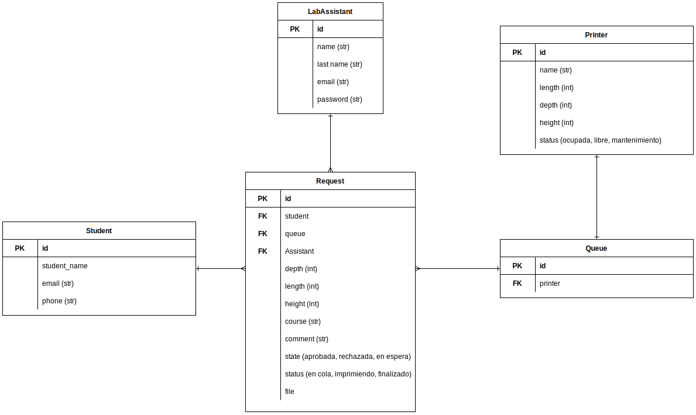

# Laboratorio_Prototipos_web_app
 A general Porpouse web app for the Lab

 This is a little project with the objective of clarify and organice the different Lab process and activities, 
 hopping to be a tool that could help students and coordinators to take advantage of the many machines and tools 
 available in the lab, mantainig the order and the trasability requested by the Faculty.

 # Development Enviroment 

 - Docker Compose
 - Ruby on Rails
 - PostgreSql

 For ease of use the development enviroment is going to be integrated in a docker container. This hopping to standarize the dependencies, features and tools, operating system. Please be aware that the minimum specs required tu run the containers are at list 4 gb of ram and a procesor compatible with virtualization (As is stated in the docker [documentation](https://docs.docker.com/desktop/install/linux-install/)). Also, be sure that the virtualization option is activated in your BIOS.

## First Setup

### 1. Start the web_app console

    $ docker compose run web_app bash

### 2. Bundle install

Inside the container console

    $ /app# bundle config set --local path vendor/bundle
    $ /app# bundle install

### 3. Start the database

Inside the container console

    $ /app# bin/setup

### 4. run the web_app 

In another console

    $ docker compose up

## Considerations

The work environment must be executed inside the docker container, for that you always have to call the container console before:

    $ docker compose run web_app bash

Then you can execute commands like, `bundle install` or `bin/rails g`.

# Data Model

The primarily data model considers the entities, atributes and relations represented in the following Relational Diagram:

 # Useful Links 

 - Development Enviroment Build Guide (Not needed for the development): [Link](https://www.sobyte.net/post/2022-03/rails-on-docker/#introduction-to-docker-compose)

